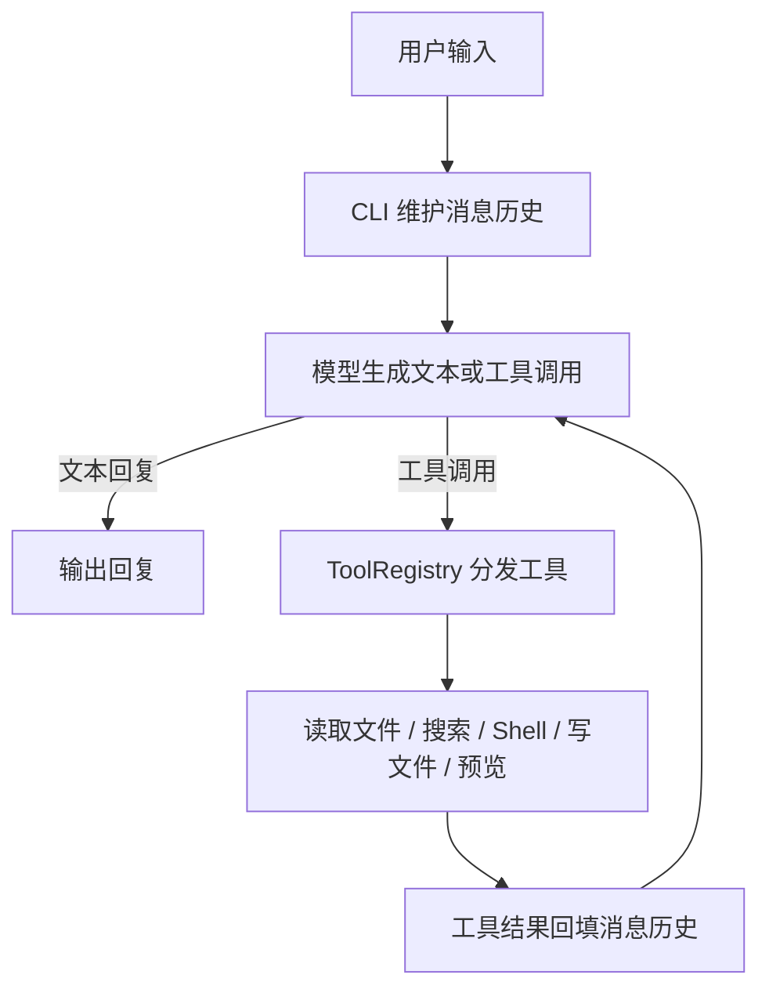

# Minimalism Coding Agent

一个用 TypeScript 编写的最小化 Coding Agent。它通过模型理解用户需求，并在本地工作区中读取文件、搜索代码、执行命令、修改文件以及启动前端预览服务。

仓库同时包含一个由 Agent 操作的 React Todo 示例应用，方便验证“理解需求 → 修改项目 → 构建运行”的完整流程（前端预览需借助 Vite，见下文）。

## 核心能力

- **多轮对话**：持续保存当前会话的消息历史。
- **工具调用循环**：模型调用工具后，Agent 将工具结果写回上下文，继续执行下一步。
- **文件操作**：读取、新建、覆盖和精确替换文件，列出目录内容。
- **代码搜索**：按 glob 模式查找文件，使用正则表达式搜索文件内容。
- **Shell 执行**：执行本地 shell 命令并返回输出，单次超时时间为 10 秒。
- **前端预览**：启动 `app/` 目录的简单静态 HTTP 服务器（不编译 TSX，适合纯静态页面）。
- **Mock 模型**：未配置 API Key 时可直接运行，便于本地演示 Agent 的流式输出和对话历史。
- **结果截断**：工具返回内容默认限制为 3000 字符，避免过长结果占满上下文。

## 工作方式



每次用户输入最多执行 50 个 Agent step。当模型在某一步不再调用工具时，循环结束并返回最终文本。

## 项目结构

```text
.
├── src/
│   ├── index.ts                    # CLI 入口、模型初始化和交互循环
│   ├── mock-model.ts               # 本地 Mock 模型
│   ├── agent/loop.ts               # 模型与工具的多步执行循环
│   └── tools/
│       ├── index.ts                # 默认工具集合
│       ├── tool-registry.ts        # 工具注册与 AI SDK 格式转换
│       └── CommonTool/
│           ├── file-tools.ts        # 文件读写、精确编辑、目录列表
│           ├── search-tools.ts      # glob 和 grep
│           ├── shell-tools.ts       # bash
│           └── start_preview-tools.ts
├── app/                            # React + Vite Todo 示例应用
├── dist/                           # TypeScript 编译产物
├── .env.example                    # 模型配置示例
├── package.json                    # Agent 包配置
└── pnpm-workspace.yaml             # pnpm workspace 配置
```

## 内置工具

| 工具 | 作用 |
| --- | --- |
| `read_file` | 读取指定文件 |
| `write_file` | 覆盖写入文件 |
| `edit_file` | 对唯一匹配的 `old_string` 做精确替换 |
| `list_directory` | 列出目录下的文件和子目录 |
| `glob` | 按 `*`、`**` 模式搜索文件 |
| `grep` | 以正则表达式搜索文件内容并返回行号 |
| `bash` | 执行 shell 命令 |
| `start_preview` | 启动 `app/` 静态预览服务（纯静态文件，不编译 TSX），默认端口为 `8080` |

工具通过 `ToolRegistry` 注册，并自动转换为 Vercel AI SDK 可识别的工具格式。新增工具时，实现 `ToolDefinition` 并加入 `src/tools/index.ts` 即可。

## 快速开始

### 环境要求

- Node.js
- pnpm

### 安装依赖

```bash
pnpm install
```

### 直接启动

不配置 API Key 时，Agent 使用本地 Mock 模型：

```bash
pnpm start
```

开发时可使用自动重启：

```bash
pnpm dev
```

启动后，在终端输入内容即可对话。注意 Mock 模型只返回固定文案，用于演示流式输出和多轮对话历史，**不会真正调用工具**；体验"读取文件 → 修改代码 → 执行命令"的完整工具调用流程，请先按下一节配置真实模型。

输入 `exit` 退出。

### 接入真实模型

复制环境变量示例并填写兼容 OpenAI API 的服务配置：

```bash
cp .env.example .env
```

```dotenv
PROVIDER=custom
NAME=your-model-name
BASE_URL=https://your-openai-compatible-endpoint/v1
API_KEY=your-api-key
```

配置 `API_KEY` 后，启动入口会切换到真实模型；未配置时自动使用 Mock 模型。

接入真实模型后，可以让 Agent 真正操作项目，例如：

```text
You: 查看当前项目结构，并告诉我 React 应用的入口文件
You: 修改 app 左上角的产品名称
```

## React 示例应用

`app/` 是一个 React + Vite 的 Todo 应用，包含：

- 列表、看板和日历三种视图
- 任务分类、优先级、标签、搜索和排序
- 新建、编辑、删除、完成和置顶任务
- 子任务进度管理
- 番茄钟专注计时
- 浅色 / 暗色主题
- 使用 `localStorage` 保存任务和主题设置
- 完成任务时的庆祝动画

单独运行前端开发服务器：

```bash
pnpm --dir app dev
```

构建前端：

```bash
pnpm --dir app build
```

注意：Agent 的 `start_preview` 工具只是静态文件服务器，固定服务 `app/` 目录且不编译 TSX，因此**无法直接预览本示例的 React 源码**（浏览器会因无法解析 TSX 而白屏）。预览该应用请使用上面的 Vite 命令；`start_preview` 仅适合 `app/` 下放置纯 HTML/JS 原型的场景。

## 常用命令

| 命令 | 说明 |
| --- | --- |
| `pnpm start` | 启动 Coding Agent |
| `pnpm dev` | 以 watch 模式启动 Coding Agent |
| `pnpm build` | 编译 `src/` 到 `dist/` |
| `pnpm --dir app dev` | 启动 React 开发服务器 |
| `pnpm --dir app build` | 构建 React 应用 |
| `pnpm --dir app preview` | 预览前端构建产物 |

## 设计特点

### 小而清晰的 Agent Loop

核心逻辑集中在 `src/agent/loop.ts`：每轮只让模型推进一步，手动消费完整流并收集文本、工具调用和工具结果。这使工具执行过程可观察，也便于后续增加日志、权限确认和更复杂的停止条件。

### 可扩展的工具注册机制

工具定义包含名称、描述、参数 Schema、执行函数以及读写属性等元数据。注册表负责统一暴露工具，业务代码不需要直接拼装模型调用格式。

### 低门槛的本地演示

Mock 模型实现了 AI SDK 所需的最小模型接口，并以延迟字符流模拟真实模型输出。即使没有外部模型服务，也能验证 CLI 和消息历史流程。

## 当前边界

- 工具默认基于当前工作目录执行，写文件和 shell 命令没有额外的权限确认层。
- `glob`、`grep` 和工具结果都有数量或字符上限，适合小型项目和原型场景。
- `start_preview` 是简单静态文件服务器，不负责 TypeScript 编译、热更新或 SPA fallback。
- 当前 CLI 是单会话交互模式，不包含 Web UI、用户鉴权、并发会话和持久化会话存储。
- 项目当前没有独立的自动化测试脚本，修改核心循环或工具时建议至少手动验证 CLI、文件编辑和前端构建流程。

## 技术栈

- TypeScript
- Node.js
- Vercel AI SDK(API适配层)
