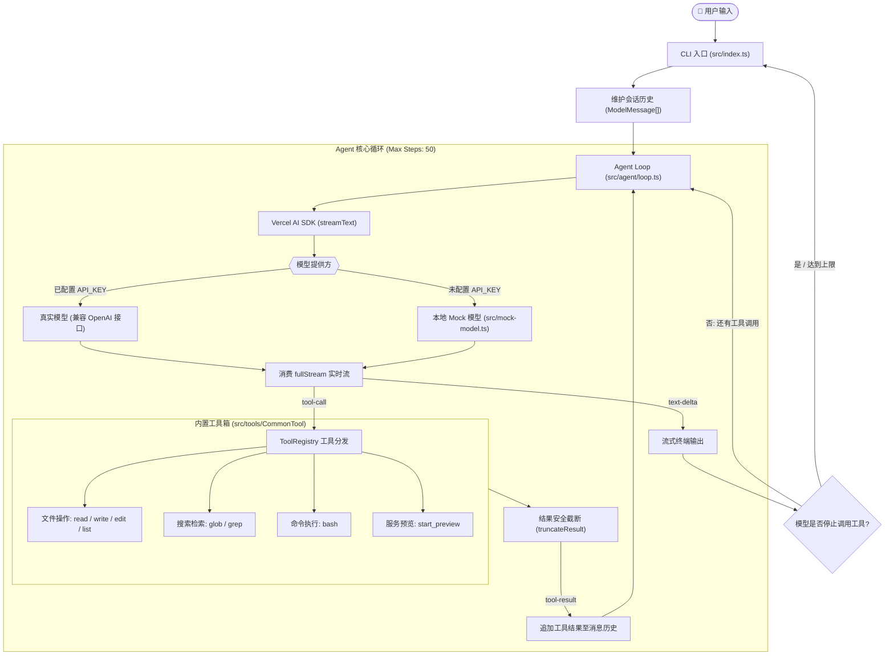

# Minimalism Coding Agent

一个用 TypeScript 编写的轻量级、模块化、极简 Coding Agent（编程智能体）。

本项目以极简代码（Minimalism）完整实现了现代 Coding Agent（类似 Claude Code / Cursor Agent 原型）的核心运行机制：**多轮对话上下文管理**、**基于 ReAct 的多步工具调用循环**、**文件操作与代码搜索**、**本地 Shell 执行**、**上下文结果截断保护**以及**离线 Mock 模型支持**。

项目中还包含一个作为“练兵场”的完整 React 19 + Vite Todo 示例应用，用于演练和验证 Agent 自动化“理解需求 → 检索定位 → 修改代码 → 构建验证”的全流程。

---

## 🌟 核心特性与设计理念

- 🎯 **极简与可控的 Agent Loop**：基于 Vercel AI SDK 的 `streamText`，单步驱动模型决策，精确监听流式文本、工具调用及执行结果。
- 🔄 **完备的 ReAct 决策循环**：支持多步自治迭代（最多 50 步），工具执行结果实时回填消息上下文，直至模型完成最终回复。
- 🛠️ **全套代码编辑与工程工具**：
  - **精准编辑**：支持唯一上下文匹配的 `edit_file`，避免大文件全量重写导致的截断或缩水。
  - **高效检索**：内置通配符 `glob` 与正则 `grep`，快速跨文件、跨目录定位代码。
  - **环境交互**：内置具备超时（10s）与异常捕获保护的 `bash` 执行器。
  - **预览服务**：内置简易 HTTP 静态预览服务器。
- 🛡️ **上下文安全防护**：内置 `truncateResult` 机制，自动对超长工具结果进行前后切片保留与中间折叠（默认限 3000 字符），防止上下文窗口溢出。
- ⚡ **开箱即用（无需 Key 即可体验）**：内置遵循 AI SDK 规范的 `MockModel`，即使没有 API Key 也能本地演示流式打字效果与多轮交互。
- 🔌 **易扩展的工具注册中心**：采用 `ToolRegistry` 统一管理元数据，易于拓展 MCP (Model Context Protocol) 工具或自定义能力。

---

## 🏗️ 架构设计与执行流程



---

## 📁 项目目录结构

```text
.
├── src/
│   ├── index.ts                     # CLI 入口：环境加载、模型初始化、对话主循环
│   ├── mock-model.ts                # 本地离线 Mock 模型实现（支持模拟流式输出）
│   ├── agent/
│   │   └── loop.ts                  # Agent 核心单步执行循环与工具结果回填机制
│   └── tools/
│       ├── index.ts                 # 工具统一导出与默认工具集装配
│       ├── tool-registry.ts         # 工具注册表、格式转换及结果截断逻辑
│       ├── CommonTool/              # 常用内置工具集合
│       │   ├── file-tools.ts        # read_file / write_file / edit_file / list_directory
│       │   ├── search-tools.ts      # glob / grep 文件与代码检索
│       │   ├── shell-tools.ts       # bash 命令执行（10s 超时与错误捕获）
│       │   └── start_preview-tools.ts # start_preview 静态预览服务器
│       └── McpTool/                 # [预留] MCP (Model Context Protocol) 扩展目录
├── app/                             # React 19 + TypeScript + Vite + Tailwind Todo 示例应用
├── dist/                            # TypeScript 编译输出目录
├── .env.example                     # 环境变量配置模板
├── package.json                     # 项目配置与依赖说明
├── tsconfig.json                    # TypeScript 编译配置
└── pnpm-workspace.yaml              # pnpm workspace 配置
```

---

## 🧰 内置工具一览

| 工具名称 | 参数 | 特性与描述 |
| :--- | :--- | :--- |
| `read_file` | `path` | 读取指定路径文件内容，支持相对或绝对路径。 |
| `write_file` | `path`, `content` | 写入文件；若文件不存在则新建，已存在则完整覆盖。 |
| `edit_file` | `path`, `old_string`, `new_string` | 精确匹配替换。当 `old_string` 出现 0 次或多次时均会拒绝并提示，保证编辑安全。 |
| `list_directory`| `path?` | 树状列出指定目录下的文件与子目录（标注 `[DIR]` / `[FILE]`）。 |
| `glob` | `pattern`, `path?` | 快速文件匹配，支持 `*` 和 `**`（如 `src/**/*.ts`），自动忽略 `node_modules` 和 `.git`。 |
| `grep` | `pattern`, `path?` | 基于正则表达式的全文检索工具，返回匹配文件的相对路径及精准行号。 |
| `bash` | `command` | 在本地环境执行 Shell 命令，内置 10 秒超时机制，捕获 stdout/stderr。 |
| `start_preview`| `port?` | 启动 `app/` 目录的本地 HTTP 静态服务器（默认端口 8080）。 |

---

## 🚀 快速上手

### 1. 环境准备

- [Node.js](https://nodejs.org/) (>= 18.0.0)
- [pnpm](https://pnpm.io/) (>= 8.0.0)

```bash
# 克隆仓库并安装依赖
pnpm install
```

### 2. 启动 Agent

#### 模式 A：零配置体验（Mock 模式）

未配置 `.env` 中的 `API_KEY` 时，Agent 会自动启用内置的离线 Mock 模型：

```bash
pnpm start
# 或者以开发监听模式启动
pnpm dev
```

> 💡 **提示**：Mock 模型主要用于验证 CLI 交互、流式渲染及消息历史结构，不会真正触发工具执行。

#### 模式 B：接入真实大模型

复制配置文件并填入兼容 OpenAI 接口的配置（如 DeepSeek、Qwen、Gemini、OpenAI 等）：

```bash
cp .env.example .env
```

编辑 `.env` 文件：

```dotenv
PROVIDER=custom
NAME=qwen-plus                      # 模型名称
BASE_URL=https://dashscope.aliyuncs.com/compatible-mode/v1 # API Base URL
API_KEY=sk-xxxxxxxxxxxxxxxxxxxx     # 你的 API Key
```

启动 Agent：

```bash
pnpm start
```

---

## 💻 对话实战示例

接入真实大模型后，可以在终端输入各类复杂的工程任务：

```text
Coding Agent v0.3 (type "exit" to quit)

You: 请帮我查看 app/src/App.tsx 的核心结构，并把左上角的标题改成 "TestSystem"
--- Step 1 ---
[调用: read_file({"path":"app/src/App.tsx"})]
[结果: "...文件内容..."]
→ 模型还在工作，继续下一步...

--- Step 2 ---
[调用: edit_file({"path":"app/src/App.tsx","old_string":"Taskflow","new_string":"TestSystem"})]
[结果: "已替换 app/src/App.tsx 中的内容"]
→ 模型还在工作，继续下一步...

--- Step 3 ---
已成功修改 app/src/App.tsx 中的标题为 "TestSystem"。

You: 运行 build 检查前端项目是否能正常编译
--- Step 1 ---
[调用: bash({"command":"pnpm --dir app build"})]
[结果: "vite v6.0.7 building for production... ✓ built in 230ms"]
→ 模型还在工作，继续下一步...

--- Step 2 ---
前端应用编译成功，没有发现类型或语法错误！
```

---

## 📱 示例应用（app/）

项目根目录下的 `app/` 包含一个完整的现代 React Todo 应用：

- 🎨 **视图与管理**：支持列表（List）、看板（Board）、日历（Calendar）三种视图。
- 🔍 **检索与分类**：支持多标签、工作/生活/学习分类、优先级筛选与全文即时检索。
- ⏱️ **番茄钟专注**：内置 Pomodoro 计时器与倒计时提醒。
- 🌓 **个性化体验**：支持浅色/暗色主题，操作完成动画，`localStorage` 本地持久化。

运行前端开发服务：

```bash
pnpm --dir app dev
```

构建前端产物：

```bash
pnpm --dir app build
```

---

## 🔧 二次开发与扩展

### 添加自定义工具

1. 在 `src/tools/CommonTool/` 下创建工具实现文件，定义 `ToolDefinition`：

```typescript
import type { ToolDefinition } from '../tool-registry';

export const myCustomTool: ToolDefinition = {
  name: 'my_custom_tool',
  description: '工具的作用说明',
  parameters: {
    type: 'object',
    properties: {
      param1: { type: 'string', description: '参数说明' }
    },
    required: ['param1'],
    additionalProperties: false,
  },
  isReadOnly: true,
  execute: async ({ param1 }) => {
    // 你的业务逻辑
    return `执行结果: ${param1}`;
  },
};
```

2. 在 `src/tools/index.ts` 中引入并加入 `allTools` 数组即可生效。

---

## 🛠️ 技术栈

- **语言环境**：TypeScript / Node.js
- **Agent 框架与适配层**：[Vercel AI SDK (`ai`)](https://sdk.vercel.ai/)、`@ai-sdk/openai`
- **开发与构建工具**：`tsx`、`tsc`、`pnpm workspace`
- **示例应用技术栈**：React 19、Vite、Tailwind CSS、Lucide React
